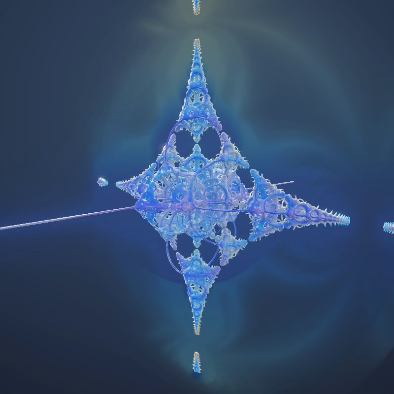

# Pseudo-Kleinian

A real-time 3D **pseudo-Kleinian fractal** rendered by distance-estimated raymarching, written in C#/.NET on raw Win32, WGL, and OpenGL 3.3 core. No NuGet packages, no engine, no OpenGL wrapper, no assets — window creation, WGL context, OpenGL loading, and the entire renderer are implemented directly through P/Invoke.

The whole image is generated by a single fragment shader running over one fullscreen quad. There is no geometry: the surface is defined implicitly by a distance estimator, and every pixel marches a ray until it gets close enough to the surface.

## Screenshot
 

## How it works

The shape comes from **Knighty's pseudo-Kleinian distance estimator**: each iteration applies a *box fold* (`p = 2·clamp(p, -CSize, CSize) - p`) followed by a *spherical inversion* (`p *= max(Size/dot(p,p), 1)`), accumulating a scale factor. After a handful of iterations the accumulated scale converts the folded position into a conservative distance to the fractal surface. Marching that estimate produces the familiar infinite Kleinian "architecture."

Shading is done analytically from the distance field:

- surface normal from the gradient of the estimator (tetrahedron sampling),
- a soft shadow from a single key light,
- cheap ambient occlusion from the raymarch step count,
- an **orbit-trap palette** (the closest approach to the axes/origin during folding drives a cosine colour palette),
- an additive proximity glow, distance fog, a fresnel rim, and emissive crevices.

The scene is rendered to an HDR texture and run through a small **bloom pipeline** — bright-pass, separable Gaussian blur (ping-pong between two half-resolution framebuffers), then an additive composite with ACES filmic tonemapping — so the luminous parts bleed light.

## Controls

| Input | Action |
| --- | --- |
| **M** | **Toggle morph mode** — continuously eases through every variant in a loop |
| **SPACE** | Next variant |
| **Backspace** | Previous variant |
| **1 – 6** | Jump straight to a variant |
| Left mouse drag | Orbit camera |
| Mouse wheel | Zoom |
| E | Offline export: render one clean camera orbit to `frames/frame_XXXX.png` |

The camera also drifts slowly on its own when idle.

## Morph mode

Press **M** to start morphing. Every parameter — box-fold extents, iteration
count, carve radius, cross-section, the per-iteration twist, the Julia offset and
the palette shift — is interpolated, so one shape physically dissolves into the
next: the crystal sprouts a twist, the twist tightens into a helix, the helix
melts into organic growths, and so on around the loop. It dwells on each variant
for about a second (`MorphHold`), then glides to the next over a couple of seconds
(`MorphTravel`, both near the top of `Program.cs`) with smoothstep easing. The
camera distance breathes along with it. Press **M** again to stop on the current
variant; SPACE / number keys still work while morphing to redirect where it goes
next.

## Variants

One fragment shader, six distinct shapes — each preset is a different point in the
estimator's parameter space (box-fold extents, iteration count, carve radius,
cross-section thickness, a per-iteration twist, an optional Julia offset, and a
palette shift). Switching also reframes the camera and shows the variant name in
the title bar.

| # | Name | What changes |
| --- | --- | --- |
| 1 | Cross | The original cross with axis spikes (default). |
| 2 | Snowflake | Symmetric box-fold + extra iterations → a denser, lacier orb. |
| 3 | Cathedral | Asymmetric folds and a larger carve sphere → open vaulted architecture. |
| 4 | Spiral | A gentle per-iteration twist breaks the mirror symmetry into swirls. |
| 5 | Helix | A stronger twist plus a hue rotation → corkscrew structure. |
| 6 | Organic | A Julia constant added each iteration melts the crystal into fleshy growths. |

All presets live in the `Presets[]` table at the top of `Program.cs` — copy a row,
change the numbers, and you have a new variant; the shader already exposes every
knob as a uniform.

## Offline export (smooth video without realtime lag)

Press **E** to render exactly one full camera orbit to disk as a numbered PNG sequence in a `frames/` folder (1920x1080, 240 frames by default). Each frame is rendered to an offscreen framebuffer and read back with `glReadPixels`, then written with a small built-in PNG encoder (BCL `ZLibStream`, no image library). Because frames are written one-by-one rather than in realtime, the resulting video is perfectly smooth no matter how heavy the shader is.

A `frames/make_video.txt` is written alongside the frames with the ffmpeg command to assemble them, e.g.:

```
ffmpeg -framerate 30 -i frame_%04d.png -c:v libx264 -pix_fmt yuv420p -crf 18 kleinian.mp4
```

Export resolution and frame count are the `ExportW`, `ExportH`, `ExportFrames` constants in `Program.cs` (bump to 3840x2160 for 4K).

## Tweakable parameters

In `Program.cs`:

- `CSize` — the box-fold half-extents (default `vec3(1.0, 1.0, 1.3)`); the main shape control.
- `_size` — the inversion radius factor (default `1.0`).
- `_iters` — fold/inversion iterations (default `10`); more iterations add detail at the cost of speed.

The `0.92784` constant and the final `max(...)` term in the estimator set the cross-section of the structure and can be experimented with.

## Build & run

```
dotnet run -c Release
```

Requires Windows and the .NET 8 SDK.

## Support

If you found this project interesting or useful, you can support my work:

[](https://github.com/sponsors/makarov-mm)